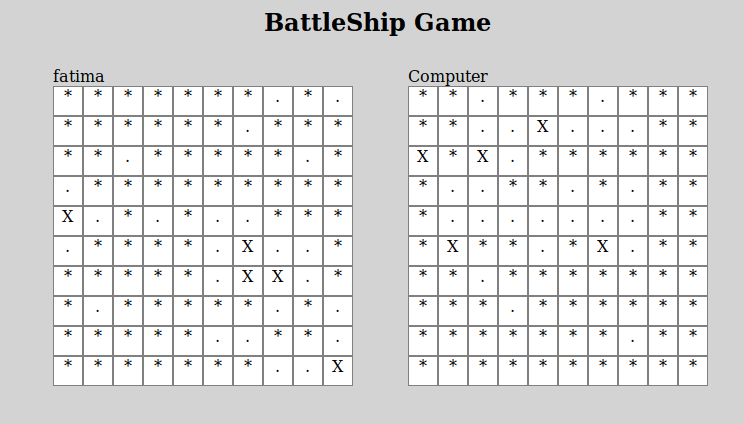
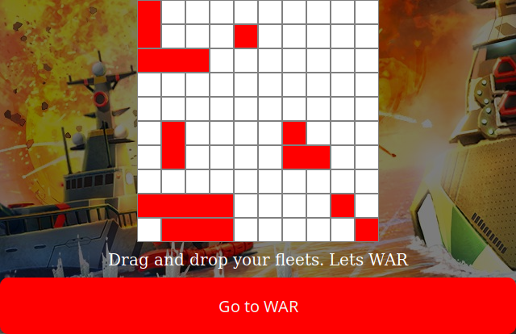

# battleship
The famous [battleship game](https://en.wikipedia.org/wiki/Battleship_(game)) built in JavaScript and Jest as the testing framework.

[Live Link](https://raw.githack.com/Urchmaney/battleship/master/dist/index.html)

Used:
- Javascript
- Jest (Testing Framework)
- Webpack
- Babel

### Future Features
- Implement different difficulty modes
- Create a 2 player option

# Instruction
- Enter player's name.
- Click on the Set Board button to set up the board with drag and drop.
- Click on `start game` button to start the game.

## Authors

👤 **Fatima Ahmed**

- Github: [@githubhandle](https://github.com/fatymahmed)
- Twitter: [@twitterhandle](https://twitter.com/fatymahmed)
- Linkedin: [linkedin](https://www.linkedin.com/in/fatimahmed/)

👤 **Kingsley Uche**

- Github: [@githubhandle](https://github.com/Urchmaney)
- Linkedin: [linkedin](https://www.linkedin.com/in/kingsley-uche/)
- Twitter: [@twitterhandle](https://twitter.com/kingsleyunegbu)

